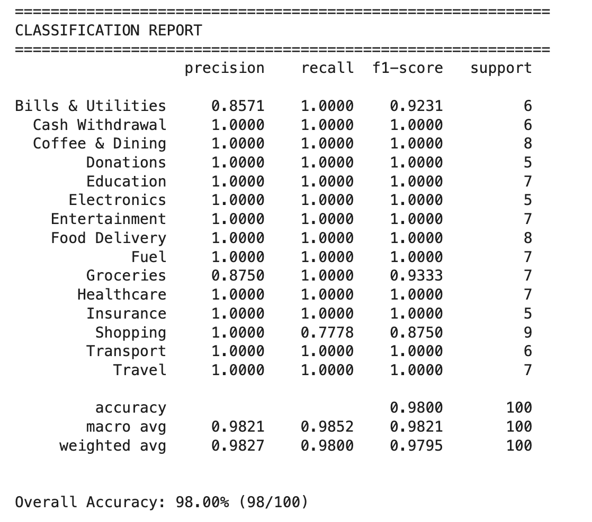
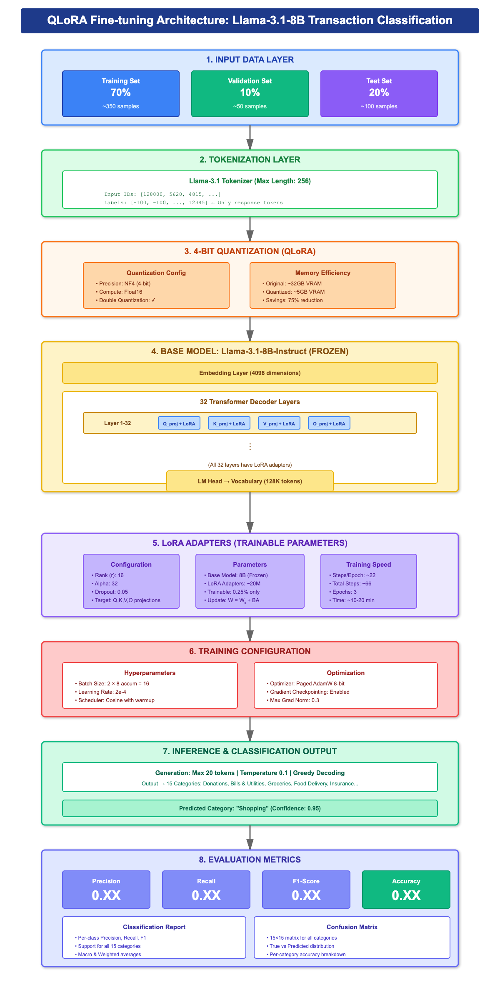

# Transaction Classification using Llama

This project demonstrates fine-tuning using **QLoRA** on **Llama-3.1-8B** for category classification on a transaction dataset.

## Result

## 🚀 Running Steps

To fine-tune the model using QLoRA, simply run:

~~~
pip install -r requirements.txt
python llama_fine_tuning.py
~~~

## QLoRA Fine-tuning Architecture

